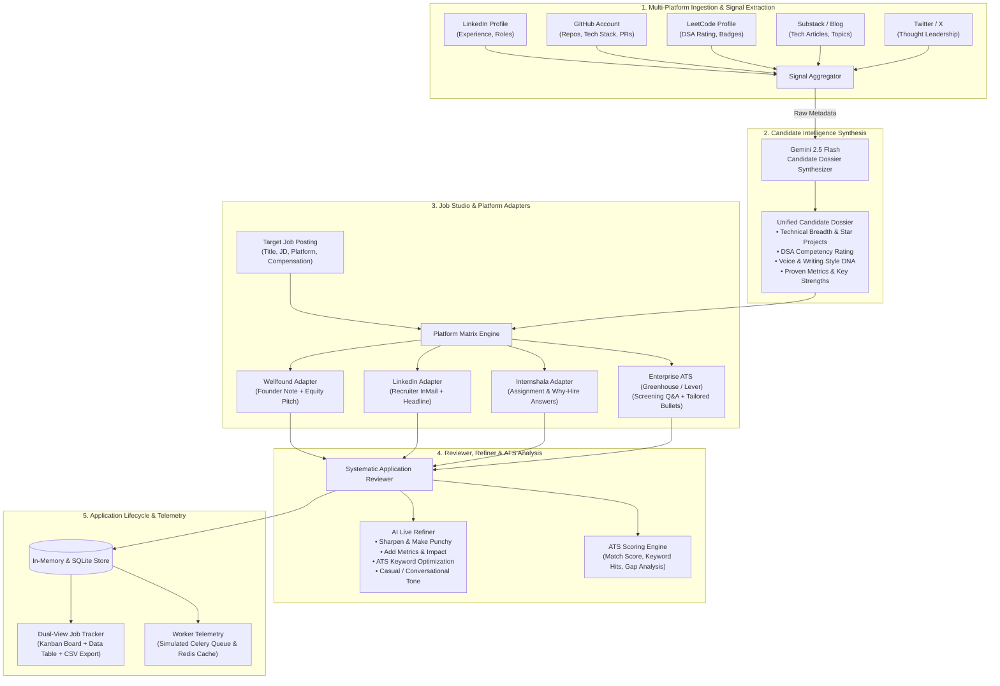

# 🚀 OmniApply AI — Autonomous Career Intelligence & Multi-Platform Application Engine

[](https://www.typescriptlang.org/)
[](https://reactjs.org/)
[](https://expressjs.com/)
[](https://tailwindcss.com/)
[](https://ai.google.dev/)
[]()

**OmniApply AI** is a multi-platform job application and career intelligence suite. It aggregates candidate public footprints across **LinkedIn, GitHub, LeetCode, Substack, and Twitter/X**, synthesizes a **Unified Candidate Dossier**, and generates tailored, ATS-optimized application packages for **Wellfound, LinkedIn, Internshala, Greenhouse, and Lever**.

---

## 📑 Table of Contents

- [Architectural Workflow Diagram](#-architectural-workflow-diagram)
- [Core Capabilities](#-core-capabilities)
- [Multi-Platform Ingestion Engine](#-multi-platform-ingestion-engine)
- [Target Platform Adapters](#-target-platform-adapters)
- [Interactive AI Draft Refiner](#-interactive-ai-draft-refiner)
- [Real-Time Celery / Redis Worker Telemetry](#-real-time-celery--redis-worker-telemetry)
- [Application Pipeline & Kanban Tracker](#-application-pipeline--kanban-tracker)
- [API Reference](#-api-reference)
- [Tech Stack](#-tech-stack)
- [Getting Started & Local Setup](#-getting-started--local-setup)
- [Honest Disclosures & Best Practices](#-honest-disclosures--best-practices)

---

## 🧩 Architectural Workflow Diagram



---

## 🌟 Core Capabilities

| Feature | Description |
|---|---|
| **Multi-Source Footprint Aggregator** | Pulls from 5 developer platforms simultaneously to understand your complete engineering, algorithmic, and writing background. |
| **Unified Candidate Dossier** | Structures your skills into verified languages, star repositories, DSA percentiles, technical domains, and key quantifiable metrics. |
| **Platform-Specific Cover Letters** | Adjusts tone and format specifically for Wellfound founders, LinkedIn recruiters, Internshala mentors, or enterprise hiring managers. |
| **Automated Screening Q&A** | Generates detailed, candidate-grounded answers for recurring questions (notice period, compensation expectations, relocation, system architecture experience). |
| **Deterministic ATS Analysis** | Analyzes job description keyword overlap, identifying matched terms, missing keywords, and recommended action items with a 0–100 match score. |
| **One-Click AI Refiner** | Apply real-time transformations on drafted text (make punchier, inject metrics, maximize ATS match, or soften tone). |
| **Kanban & Table Pipeline** | Track status transitions (`draft` → `prepared` → `applied` → `interviewing` → `offer` → `archived`) with CSV export support. |
| **Worker Cluster Telemetry** | View real-time background task progress, worker node IDs, Redis latency, and sub-second stage execution logs. |
| **GDPR-Compliant User Controls** | One-click JSON data export and account purge options with password management. |

---

## 🔍 Multi-Platform Ingestion Engine

OmniApply AI integrates diverse public footprint vectors to build an authentic applicant persona:

```
┌────────────────────────────────────────────────────────────────────────┐
│                        CANDIDATE SIGNALS INGESTED                      │
├───────────────────┬────────────────────────────────────────────────────┤
│ 🔗 LinkedIn       │ Work history, job titles, tenure, education        │
│ 🐙 GitHub         │ Starred repos, primary languages, commit density   │
│ ⚡ LeetCode       │ Contest ranking, solved problem count (Easy/Med/Hard)│
│ ✍️ Substack       │ Published architecture essays, tech domain depth   │
│ 🐦 Twitter / X    │ Thought leadership themes, community engagement    │
└───────────────────┴────────────────────────────────────────────────────┘
```

---

## 🎯 Target Platform Adapters

Each job board has distinct recruiter dynamics. OmniApply AI generates tailored materials for each:

### 1. Wellfound (AngelList)
- **Direct Founder Note**: 150–200 words, direct, highlighting zero-to-one ownership and product velocity.
- **Equity & Compensation Stance**: Clear statement regarding base salary vs. equity willingness.
- **Star Project Tie-in**: Connects one relevant repository directly to the startup's product problem space.

### 2. LinkedIn InMail & Pitch
- **Recruiter Pitch**: 100–140 words, optimized for quick mobile reading with bulleted career highlights.
- **Headline & Tagline**: High-converting LinkedIn connection request message (under 300 characters).

### 3. Internshala
- **Why Should You Be Hired?**: Structured 3-point answer grounded in portfolio projects and fast execution.
- **Assignment/Project Availability**: Immediate commencement availability, hours per week, and stipend expectations.

### 4. Enterprise ATS (Greenhouse & Lever)
- **Tailored Resume Bullets**: XYZ-formula bullets (`Accomplished [X], measured by [Y], by doing [Z]`).
- **Screening Questionnaire**: Complete, thoughtful answers to standard behavioral and technical prompts.

---

## ⚡ Interactive AI Draft Refiner

The Reviewer screen features live prompt transformations:

```
 ┌──────────────────────────────────────────────────────────────┐
 │                    AI PROMPT REFINER MATRIX                  │
 ├──────────────────────────┬───────────────────────────────────┤
 │ ⚡ Sharpen & Make Punchy │ Cuts fluff, makes active & direct  │
 │ 📊 Inject Quant Metrics  │ Adds latency, revenue & scale KPIs│
 │ 🎯 Boost ATS Keywords    │ Injects core JD terminology       │
 │ 💬 Conversational Tone   │ Humanizes text for early startups │
 └──────────────────────────┴───────────────────────────────────┘
```

---

## 📊 Real-Time Celery / Redis Worker Telemetry

The application includes a telemetry interface modeling a production background worker architecture:

- **Worker Cluster**: Node monitoring (`celery-worker-01`, `celery-worker-02`).
- **Task Lifecycle**: Step-by-step progress tracking (`INGESTION` → `CORRELATION` → `SYNTHESIS` → `GENERATION`).
- **Redis Stats**: Sub-millisecond cache latency tracking and task state persistence.

---

## 🗄️ Application Pipeline & Kanban Tracker

- **Kanban Board**: Drag-and-drop or dropdown status shifts across 6 stages:
  1. `Prepared / Draft`
  2. `Applied`
  3. `Interviewing`
  4. `Offer Received`
  5. `Archived`
- **Data Table View**: Compact, sortable view with quick review and deletion controls.
- **CSV Data Export**: One-click download of all job tracking records formatted for Google Sheets or Excel.

---

## 📡 API Reference

### Authentication & User
- `POST /api/auth/login` — Login or auto-create account.
- `POST /api/auth/register` — Register a new account.
- `POST /api/auth/verify-email` — Verify 6-digit verification code.
- `GET  /api/auth/me` — Retrieve current authenticated user.
- `PATCH /api/auth/profile` — Update user name, title, or location.
- `POST /api/auth/change-password` — Update user security credentials.
- `GET  /api/auth/export-data` — Export full account data as JSON.
- `DELETE /api/auth/account` — Delete account and associated jobs.

### Intelligence & Generation
- `POST /api/analyze-profiles` — Ingest candidate URLs and return unified dossier.
- `POST /api/generate-application` — Generate tailored package for target job description.
- `POST /api/refine-draft` — Apply prompt modifiers to drafted content.

### Applications & Jobs Management
- `GET    /api/jobs` — List all saved job applications.
- `GET    /api/jobs/:id` — Get single job application package.
- `PATCH  /api/jobs/:id` — Update job application fields.
- `PATCH  /api/jobs/:id/status` — Change job pipeline status.
- `DELETE /api/jobs/:id` — Delete application record.

### Telemetry
- `GET /api/tasks` — List background worker task execution logs.

---

## 🛠️ Tech Stack

- **Frontend**: React 18, TypeScript, Tailwind CSS v4, Lucide Icons, Canvas Confetti.
- **Backend**: Express 4, Node.js, TypeScript (`tsx`).
- **AI Core**: Google Gemini 2.5 Flash via `@google/genai` SDK with deterministic fallback synthesis.
- **Data Store**: Structured In-Memory database with user session tokens and JSON export.
- **Build Tool**: Vite with esbuild bundling for single-artifact server deployment.

---

## 🚀 Getting Started & Local Setup

### Prerequisites
- Node.js 18.x or higher
- npm 9.x or higher
- A Gemini API Key (optional — pre-configured mock synthesis works out of the box)

### Installation

1. **Clone the repository:**
   ```bash
   git clone https://github.com/<YOUR-USERNAME>/omniapply-ai.git
   cd omniapply-ai
   ```

2. **Install dependencies:**
   ```bash
   npm install
   ```

3. **Configure environment variables:**
   ```bash
   cp .env.example .env
   ```
   Add your Gemini API Key in `.env`:
   ```env
   GEMINI_API_KEY=your_gemini_api_key_here
   ```

4. **Start the development server:**
   ```bash
   npm run dev
   ```
   Open your browser at `http://localhost:3000`.

5. **Build for production:**
   ```bash
   npm run build
   npm start
   ```

---

## 💡 Honest Disclosures & Best Practices

1. **Human-in-the-Loop Review**: OmniApply AI creates high-fidelity drafts, but you should always review every cover note, screening answer, and salary figure before submitting to employers.
2. **Platform Terms of Service**: OmniApply AI acts as a **smart drafting assistant**. It prepares copyable text and structured packages rather than executing automated browser clicks, keeping your job board accounts safe and compliant with platform policies.
3. **Data Privacy**: Profile URLs and generated applications are stored in your active session. You can export or purge all stored data at any time via the **User Settings → Data Privacy** menu.

---

<div align="center">
  <sub>Built with ❤️ by Shivam Singh using Google AI Studio & Gemini 2.5 Flash.</sub>
</div>
